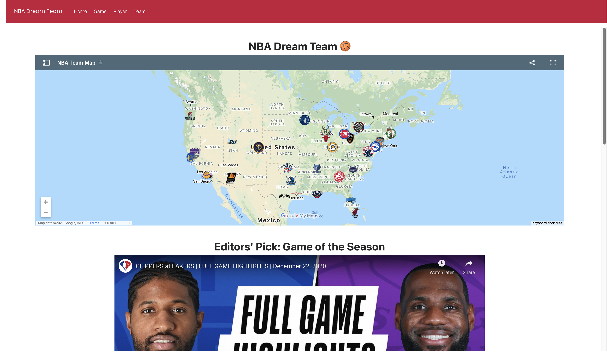
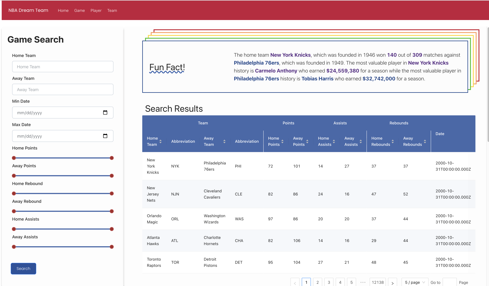

# CIS-550-NBA-Dream-Team-Project

#### Contributers: Yizheng Wang, Zijing Wu, Yulin Yu, Zihao Zhang
#### The app is deployed at: https://league-pass.herokuapp.com/
 

## Introduction
The National Basketball Association (NBA) is a professional basketball league in North America. The league is composed of 30 teams (29 in the United States and 1 in Canada) and hosts 82 games every season that lasts for a year. It is the premier men's professional basketball league in the world. In recent years, the data collection and analysis on NBA games, teams and players performance were more and more popular with the advanced technologies that could record every detail in each game. Therefore, we decided to bring our enthusiasm in basketball and NBA to the database and information system field to present this application.

The application was motivated by two perspectives. On one hand, for those who only watched one or two NBA games or only recognized Kobe Bryant, this is a great tool to get familiar with the NBA. For example, on our Home page, we presented a map that shows all NBA teams with their team names and logos on a map, splitting by eastern and western conference. In addition, we offered our personal recommendation on the best game of last season so that people could first have a quick glance at the statistics of this match and then jump into a drastic and exciting game with the game highlight. On the other hand, we also considered the common yet endless discussion among basketball fans. Not only showing the players who have the top 10 average points per game in NBA history, we also took average assist per game and average rebound per game into consideration. For some fans who cared about team contributions more than personal achievements, they could also find their favorite players on the list of NBA All Time.
